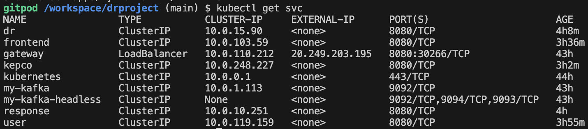

# 구현:

분석/설계 단계에서 도출된 헥사고날 아키텍처에 따라, 각 BC별로 대변되는 마이크로 서비스들을 스프링부트로 구현하였다. 구현한 각 서비스를 로컬에서 실행하는 방법은 아래와 같다 (각자의 포트넘버는 8081 ~ 808n 이다)

```
	cd dr
	mvn spring-boot:run
	
	cd frontend
	mvn spring-boot:run 
	
	cd gateway
	mvn spring-boot:run  
	
	cd kepco
	mvn spring-boot:run
	
	cd response
	mvn spring-boot:run

	cd user
	mvn spring-boot:run
```

## API 게이트웨이
Local 테스트 환경에서는 localhost:8080에서 Gateway API 가 작동.
Cloud 환경에서는 http://20.249.203.195:8080/ 에서 Gateway API가 작동.
application.yml 파일에 프로파일 별로 Gateway 설정.
```
server:
  port: 8088

---

spring:
  profiles: default
  cloud:
    gateway:
#<<< API Gateway / Routes
      routes:
        - id: dr
          uri: http://localhost:8082
          predicates:
            - Path=/drs/**, 
        - id: response
          uri: http://localhost:8083
          predicates:
            - Path=/responses/**, 
        - id: user
          uri: http://localhost:8084
          predicates:
            - Path=/users/**, 
        - id: kepco
          uri: http://localhost:8085
          predicates:
            - Path=/kepcos/**, 
        - id: frontend
          uri: http://localhost:8080
          predicates:
            - Path=/**
#>>> API Gateway / Routes
      globalcors:
        corsConfigurations:
          '[/**]':
            allowedOrigins:
              - "*"
            allowedMethods:
              - "*"
            allowedHeaders:
              - "*"
            allowCredentials: true


---

spring:
  profiles: docker
  cloud:
    gateway:
      routes:
        - id: dr
          uri: http://dr:8080
          predicates:
            - Path=/drs/**, 
        - id: response
          uri: http://response:8080
          predicates:
            - Path=/responses/**, 
        - id: user
          uri: http://user:8080
          predicates:
            - Path=/users/**, 
        - id: kepco
          uri: http://kepco:8080
          predicates:
            - Path=/kepcos/**, 
        - id: frontend
          uri: http://frontend:8080
          predicates:
            - Path=/**
      globalcors:
        corsConfigurations:
          '[/**]':
            allowedOrigins:
              - "*"
            allowedMethods:
              - "*"
            allowedHeaders:
              - "*"
            allowCredentials: true

server:
  port: 8080

```


## CI/CD 설정

아래 이미지는 azure의 pipeline에 각각의 서비스들을 올려, 코드가 업데이트 될때마다 자동으로 빌드/배포 하도록 하였다.


그 결과 kubernetes cluster에 아래와 같이 서비스가 올라가있는 것을 확인할 수 있다.




먼저, 임의의 사용자를 등록한다.


