# DR(전력중개) 관리 플랫폼 


## 도메인 설명
- **DR 제도 설명**: 전기 사용자가 전기 사용량을 감축하고 이를 전력시장에 판매하여 금전적인 보상을 받는 제도

- **KPX의 역할**: KPX(전력거래소)는 전력 감축이 필요한 상황이 발생하면, 수요관리사업자인 KT와 같은 사업자에게 DR 명령을 전달한다. 수요관리사업자는 이 명령을 바탕으로 즉시 고객에게 전력 감축 요청을 전달하며, KPX는 전력 감축 여부를 확인하고 이에 따라 정산금을 지급한다.


- **KT의 역할(수요관리업자)**: DR 참여 고객을 발굴하고, 전력 감축 요청이 있을 때 이를 고객에게 안내하는 역할을 수행한다. 또한, 전력 감축이 완료되면 KPX로부터 받은 금액을 고객에게 정산하는 업무를 처리한다.

- **관리 시스템 필요성**: KT는 현재 DR 관련 업무를 진행 중이나, 별도 관리 툴이 없어 오류와 지연 가능성이 있으며, 이를 개선하기 위해 전력 감축 안내 및 이행 여부를 확인하는 통합 관리 시스템이 필요함.

## Model
[www.msaez.io/#/72932922/storming/drproject
](https://www.msaez.io/#/72932922/storming/drproject)

### Github Link
[https://github.com/Wonchul-Shin/drproject](https://github.com/Wonchul-Shin/drproject)

# 서비스 시나리오

### DR플랫폼

#### 기능적 요구사항 
1. 관리자가 DR명령을 시작/종료할 수 있다.
2. 고객이 현재 진행중인 명령에 대하여 이행(accept)/불이행(deny)를 선택한다.
3. 관리자는 실행중인 명령을 종료한다.
4. 명령이 종료되었을 때 한전에 전력사용량을 확인하고 실제 감축량만큼 유저의 포인트를 늘린다.

#### 비기능적 요구사항
1. 장애격리
    - 한전API등 각각의 서비스에 오류가 생겨도 핵심 서비스가 작동하도록 한다. 
    - 오류 발생 시 해당 마이크로서비스만 재시작하거나 복구할 수 있다.
    - 서비스를 컨테이너화 하여 오류 탐지 및 복구를 자동화하여 장애 대응 시간을 최소화한다. 
2. 성능
    - 관리자는 모든 유저의 정보와 현재 진행중인 DR 그리고 응답정보를 한눈에 확인할 수 있어야 한다. 

# 분석/설계

## Event Storming 결과
* MSAEz 로 모델링한 이벤트스토밍 결과:  www.msaez.io/#/72932922/storming/drplatproject


### 이벤트 도출
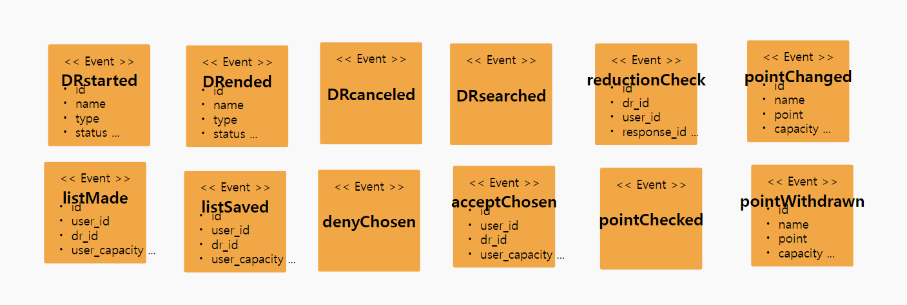


### 부적격 이벤트 탈락
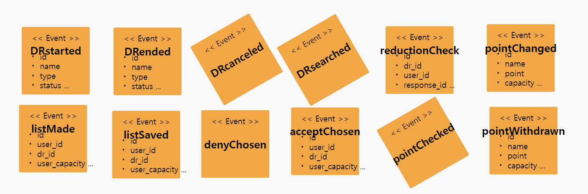

    - 과정중 도출된 잘못된 도메인 이벤트들을 걸러내는 작업을 수행함

### 액터, 커맨드 부착하여 읽기 좋게
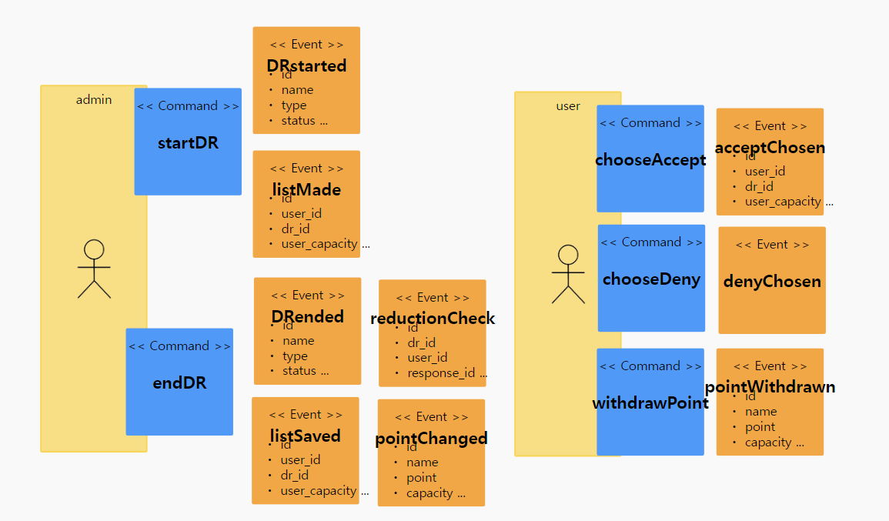

### 어그리게잇으로 묶기
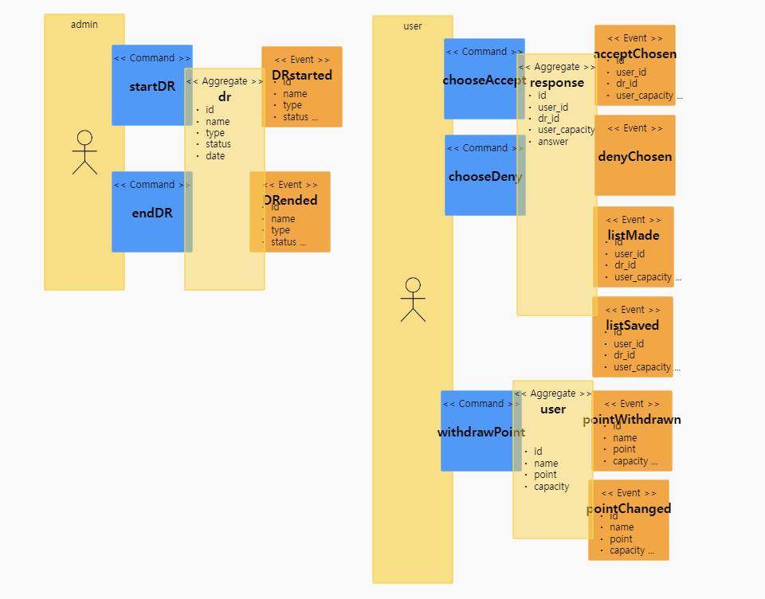

    - dr, user, response와 연결된 command 와 event 들에 의하여 트랜잭션이 유지되어야 하는 단위로 묶음

### 바운디드 컨텍스트로 묶기

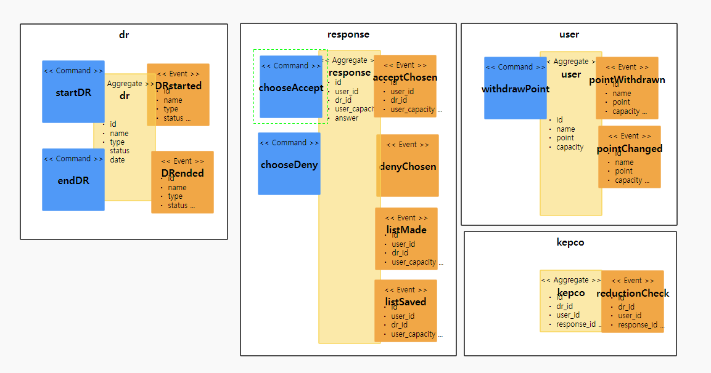

### 폴리시 부착

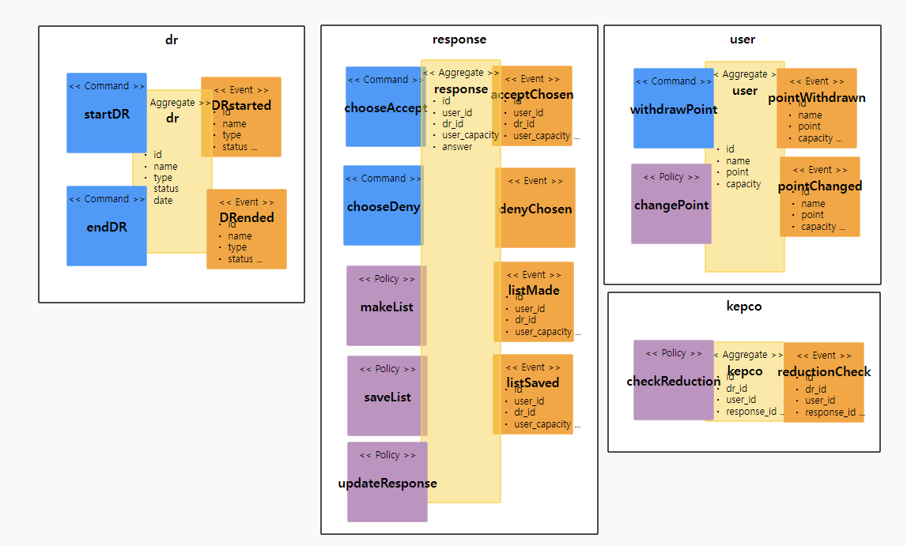 

### 완성된 모형

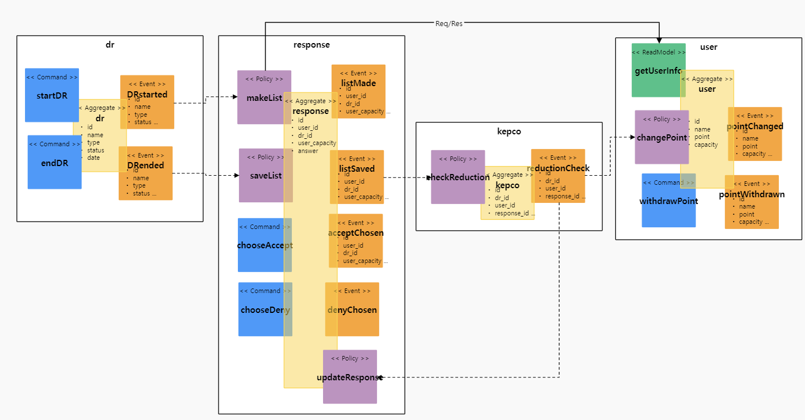 

### 요구사항을 커버하는지 검증
1. 관리자가 DR명령을 시작/종료할 수 있다. (ok)
2. 고객이 현재 진행중인 멸영에 대하여 이행/불이행을 선택한다. (ok)
3. 관리자는 실행중인 명령을 종료한다. (ok)
4. 명령이 종료되었을 때 한전에 전력사용량을 확인하고 실제 감축량만큼 유저의 포인트를 늘린다. (ok)

# 구현:

분석/설계 단계에서 도출된 헥사고날 아키텍처에 따라, 각 BC별로 대변되는 마이크로 서비스들을 스프링부트로 구현하였다. 구현한 각 서비스를 로컬에서 실행하는 방법은 아래와 같다 (각자의 포트넘버는 8081 ~ 808n 이다)

```
	cd dr
	mvn spring-boot:run
	
	cd frontend
	mvn spring-boot:run 
	
	cd gateway
	mvn spring-boot:run  
	
	cd kepco
	mvn spring-boot:run
	
	cd response
	mvn spring-boot:run

	cd user
	mvn spring-boot:run
```

## API 게이트웨이
1. gateway 스프링부트 App을 추가 후 application.yaml내에 각 마이크로 서비스의 routes 를 추가하고 gateway 서버의 포트를 8080 으로 설정함
- application.yaml 예시
```
server:
  port: 8088

---

spring:
  profiles: default
  cloud:
    gateway:
#<<< API Gateway / Routes
      routes:
        - id: dr
          uri: http://localhost:8082
          predicates:
            - Path=/drs/**, 
        - id: response
          uri: http://localhost:8083
          predicates:
            - Path=/responses/**, 
        - id: user
          uri: http://localhost:8084
          predicates:
            - Path=/users/**, 
        - id: kepco
          uri: http://localhost:8085
          predicates:
            - Path=/kepcos/**, 
        - id: frontend
          uri: http://localhost:8080
          predicates:
            - Path=/**
#>>> API Gateway / Routes
      globalcors:
        corsConfigurations:
          '[/**]':
            allowedOrigins:
              - "*"
            allowedMethods:
              - "*"
            allowedHeaders:
              - "*"
            allowCredentials: true


---

spring:
  profiles: docker
  cloud:
    gateway:
      routes:
        - id: dr
          uri: http://dr:8080
          predicates:
            - Path=/drs/**, 
        - id: response
          uri: http://response:8080
          predicates:
            - Path=/responses/**, 
        - id: user
          uri: http://user:8080
          predicates:
            - Path=/users/**, 
        - id: kepco
          uri: http://kepco:8080
          predicates:
            - Path=/kepcos/**, 
        - id: frontend
          uri: http://frontend:8080
          predicates:
            - Path=/**
      globalcors:
        corsConfigurations:
          '[/**]':
            allowedOrigins:
              - "*"
            allowedMethods:
              - "*"
            allowedHeaders:
              - "*"
            allowCredentials: true

server:
  port: 8080
```

2. Kubernetes용 Deployment.yaml 을 작성하고 Kubernetes에 Deploy를 생성함
- Deployment.yaml 예시
```
apiVersion: apps/v1
kind: Deployment
metadata:
  name: gateway
  labels:
    app: gateway
spec:
  replicas: 1
  selector:
    matchLabels:
      app: gateway
  template:
    metadata:
      labels:
        app: gateway
    spec:
      containers:
        - name: gateway
          image: kxmjhwn/gateway:latest
          ports:
            - containerPort: 8080
```
- Deploy 생성
```
kubectl apply -f deployment.yaml
```
- Kubernetes에 생성된 Deploy. 확인
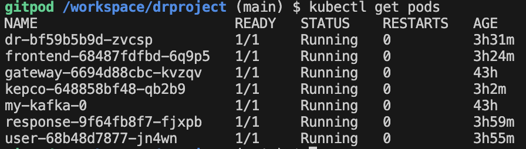


3. Kubernetes용 Service.yaml을 작성하고 Kubernetes에 Service/LoadBalancer을 생성하여 Gateway 엔드포인트를 확인함.
- Service.yaml 예시
```
apiVersion: v1
kind: Service
metadata:
  name: gateway
  labels:
    app: gateway
spec:
  ports:
    - port: 8080
      targetPort: 8080
  selector:
    app: gateway
  type: LoadBalancer
```
- Service 생성
```
kubectl apply -f service.yaml
```
- API Gateay 엔드포인트 확인
- Service 및 엔드포인트 확인

# Correlation

### DR프로젝트에서는 DR의 상태 변화에 따라 연관된 처리들이 이루어집니다.

#### 1.명령시작
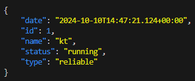

#### 2 이행리스트 자동 생성 
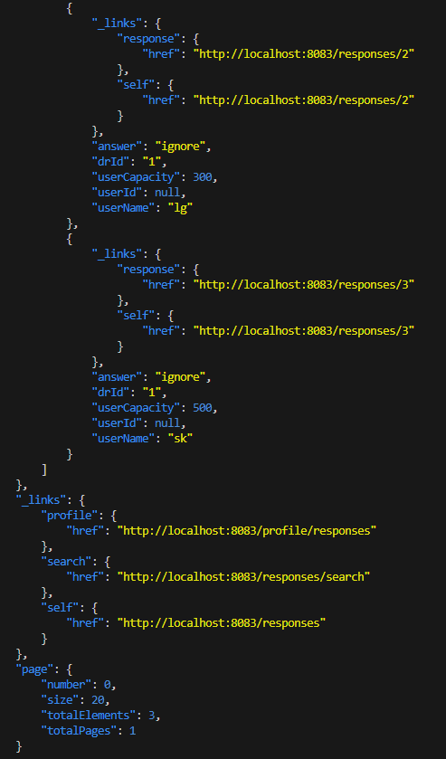

- 명령이 시작되면 req/res를 통해 user 정보를 받아와 response를 생성 
- drId 1로 유저수만큼 response 생성 (초기값 ignore)

#### 3 이행 수락 
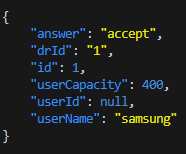

## 명령이 종료되면 이행정보의 사실 여부를 확인한 후 포인트 지급 

#### 1 명령종료
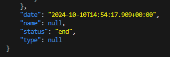

#### 2 kepco에서 사실여부 판단
- point 지급 (accept를 선택하고 실제로 이행한 경우)
- response 업데이트(accept를 선택했지만 실제로 이행하지 않은 경우)
  


## DDD 의 적용

- 각 서비스내에 도출된 핵심 Aggregate Root 객체를 Entity 로 선언하였다. (예시는 DR Project의 핵심 도메인인 reservation 마이크로 서비스).

```
@Entity
@Table(name = "Response_table")
@Data
//<<< DDD / Aggregate Root
public class Response {

    @Id
    @GeneratedValue(strategy = GenerationType.AUTO)
    private Long id;
    private Long userId;
    private String userName;
    private String drId;
    private String answer;
    private Integer userCapacity;

    @PostPersist
    public void onPostPersist() {
        Listmade listmade = new Listmade(this);
        listmade.publishAfterCommit();
        
        Listsaved listsaved = new Listsaved(this);
        listsaved.publishAfterCommit();

        if ("accept".equals(this.answer)) {
            AcceptChosen acceptChosen = new AcceptChosen(this);
            acceptChosen.publishAfterCommit();
        }

        if ("deny".equals(this.answer)) {
            DenyChosen denyChosen = new DenyChosen(this);
            denyChosen.publishAfterCommit();       
         }
    }

    public static ResponseRepository repository() {
        ResponseRepository responseRepository = ResponseApplication.applicationContext.getBean(
            ResponseRepository.class
        );
        return responseRepository;
    }

    public static void makelist(DRstarted dRstarted) {
        PagedModel<User> users = ResponseApplication.applicationContext
        .getBean(drproject.external.UserService.class)
        .getAllUsers();
            for (User user :  users.getContent()) {
                Response response = new Response();
                response.setDrId(String.valueOf(dRstarted.getId())); 
                response.setUserId(user.getId());
                response.setUserName(user.getName());
                response.setUserCapacity(user.getCapacity()); 
                response.setAnswer("ignore");     
                repository().save(response);
            }
    }

    public static void savelist(DrEnded drEnded) {
        List<Response> responses = repository().findByDrId(String.valueOf(drEnded.getId()));
        for (Response response : responses) {
            Listsaved listsaved = new Listsaved(response);
            listsaved.publishAfterCommit(); 
        }
    }
    public static void updateResponse(ReductionCheck reductionCheck) {
        if (!reductionCheck.getIsReal()) {
            repository().findById(reductionCheck.getId()).ifPresent(response -> {
                if (response.getId().equals(reductionCheck.getResponseId())) {
                    System.out.println(response.userName + "did not execute reduction");
                    response.setAnswer("deny");
                    repository().save(response);
                }
            });
        }
    }

}

```
- Entity Pattern 과 Repository Pattern 을 적용하여 JPA 를 통하여 다양한 데이터소스 유형 (RDB or NoSQL) 에 대한 별도의 처리가 없도록 데이터 접근 어댑터를 자동 생성하기 위하여 Spring Data REST 의 RestRepository 를 적용하였다
```
package drproject;

import org.springframework.data.repository.PagingAndSortingRepository;
import org.springframework.data.rest.core.annotation.RepositoryRestResource;

@RepositoryRestResource(collectionResourceRel="responses", path="responses")
public interface ResponseRepository extends PagingAndSortingRepository<Response, Long> {
}
```
- 적용 후 REST API 의 테스트
```
# reservation 서비스의 예약 요청
http POST :8082/startdr name="kt" type="reliable" status="running" date="2024-10-08"
 - startdr이 실행되면 resposne가 각 user 별 하나의 response가 만들어진다 (초기값 ignore)

# response에 대한 승인처리 
http PUT :8083/responses/2/accept

# response 확인
http :8083/responses
```

# 운영


## CI/CD 설정

0. azure 환경 구성
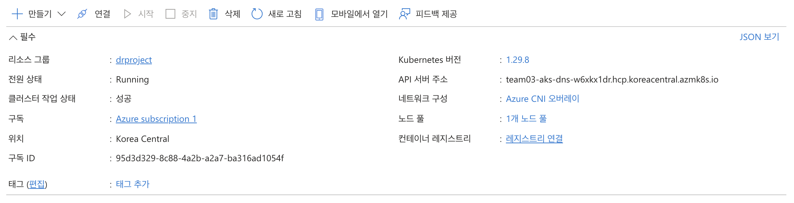

1. dr 빌드/배포
```
cd dr/
mvn clean package -B -Dmaven.test.skip=true
docker build -t kxmjhwn/dr:latest .
docker push kxmjhwn/dr:latest
# containers의 image명 변경
kubectl apply -f kubernetes/deployment.yaml
kubectl apply -f kubernetes/service.yaml
```

2. front 빌드/배포
```
cd front/
npm run build
docker build -t kxmjhwn/front:latest .
docker push kxmjhwn/front:latest
# containers의 image명 변경 및 readinessProbe 삭제
kubectl apply -f kubernetes/deployment.yaml
kubectl apply -f kubernetes/service.yaml
```

3. gateway 빌드/배포
```
cd gateway/
mvn clean package -B -Dmaven.test.skip=true
docker build -t kxmjhwn/gateway:latest .
docker push kxmjhwn/gateway:latest
# containers의 image명 변경
kubectl apply -f kubernetes/deployment.yaml
kubectl apply -f kubernetes/service.yaml
```

4. kepco 빌드/배포
```
cd kepco/
mvn clean package -B -Dmaven.test.skip=true
docker build -t kxmjhwn/kepco:latest .
docker push kxmjhwn/kepco:latest
# containers의 image명 변경
kubectl apply -f kubernetes/deployment.yaml
kubectl apply -f kubernetes/service.yaml
```

5. response 빌드/배포
```
cd response/
mvn clean package -B -Dmaven.test.skip=true
docker build -t kxmjhwn/response:latest .
docker push kxmjhwn/response:latest
# containers의 image명 변경
kubectl apply -f kubernetes/deployment.yaml
kubectl apply -f kubernetes/service.yaml
```

6. user 빌드/배포
```
cd user/
mvn clean package -B -Dmaven.test.skip=true
docker build -t kxmjhwn/user:latest .
docker push kxmjhwn/user:latest
# containers의 image명 변경
kubectl apply -f kubernetes/deployment.yaml
kubectl apply -f kubernetes/service.yaml
```

docker hub에 올라간 서비스 별 이미지 현황
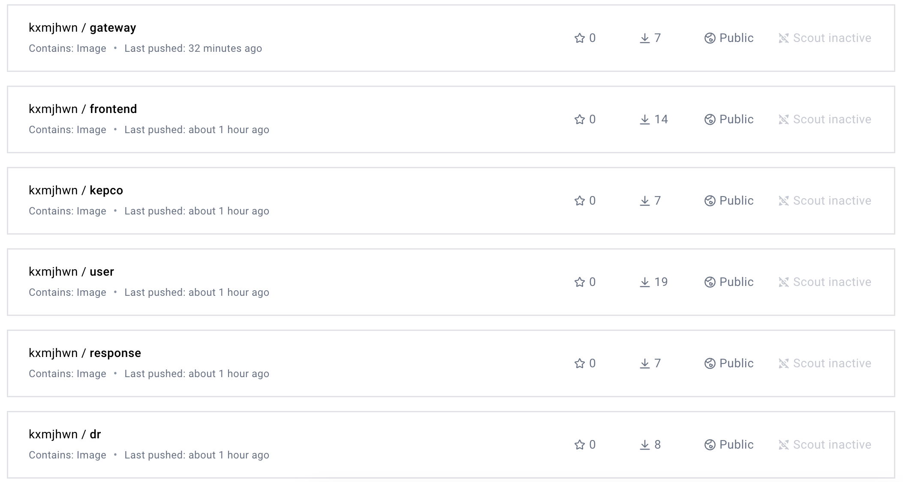

kubernetes cluster에 아래와 같이 서비스가 올라가있는 것을 확인할 수 있음.

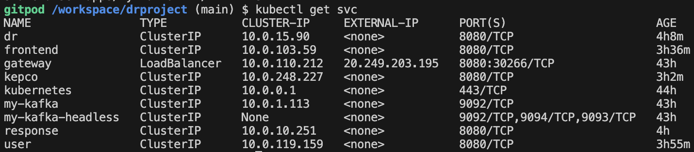

주요 이벤트 별 정상동작 확인
- user 조회
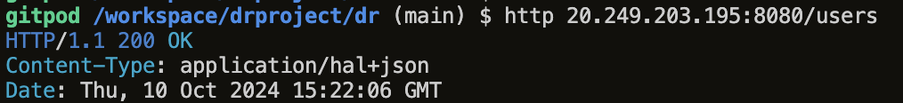

- dr 조회
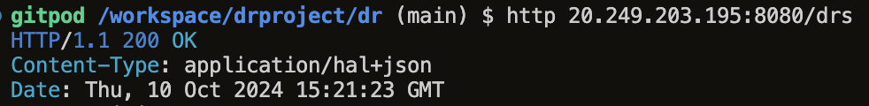

- dr 생성
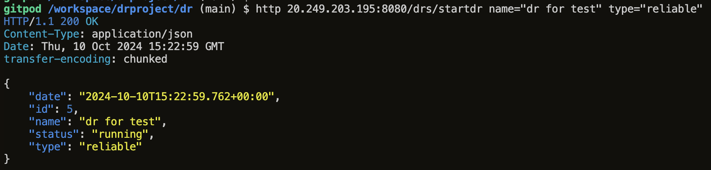

- 생성된 dr에 대한 user별 response 확인
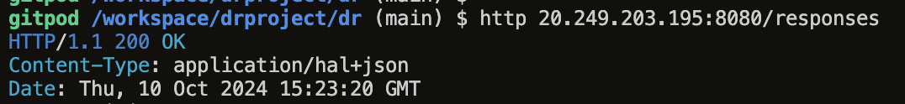

- dr 종료
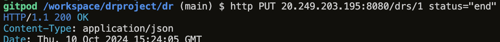

- kepco 조회(rand.)
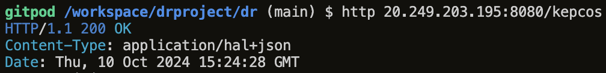


## 동기식 호출 / 서킷 브레이킹 / 장애격리


## 오토스케일 아웃

## 무정지 재배포

## Self-healing (Liveness Probe)

## Config Map/ Persistence Volume
